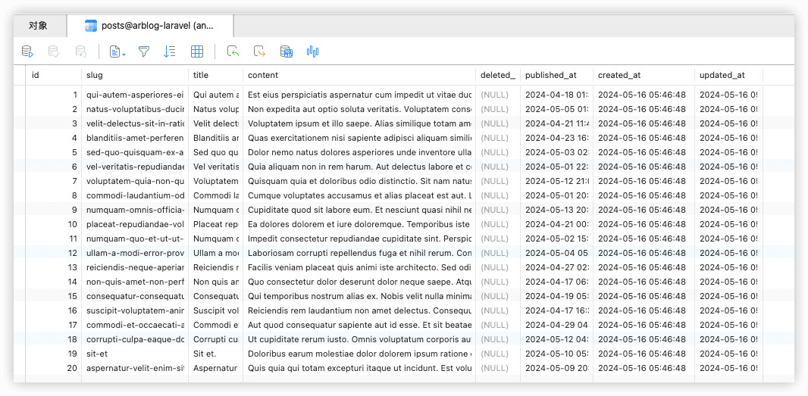

arblog-laravel
---


参考：https://laravelacademy.org/books/laravel-blog-tutorial

代码：https://github.com/andyRon/arblog-laravel


## 1 创建项目和测试驱动开发

```sh
composer create-project laravel/laravel arblog-laravel --prefer-dist 10.*
```

```sh
npm install
```


### 测试

运行默认的PHPUnit测试：

```sh
vendor/bin/phpunit
```

或在composer.json中添加相关配置后，运行`composer test`:

```json
"scripts": {
    "test" : [
        "vendor/bin/phpunit"
    ],
    ... 
},
```


Laravel项目根目录下`phpunit.xml` 是PHPUnit的配置信息，默认测试文件位于 `tests` 目录下

- `Unit/ExampleTest.php` —— 包含一个 `testBasicExample()` 测试，`Unit` 目录下包含的是**==单元测试==**类。
- `Feature/ExampleTest.php` —— 也包含一个 `testBasicExample()` 测试，用于测试访问应用首页返回状态码是否是 200，`Feature` 目录下包含的是**==功能测试==**类。

### 前端库

```json
    "devDependencies": {
        "@fortawesome/fontawesome-free": "^5.6.0",
        "@tailwindcss/forms": "^0.5.2",
        "alpinejs": "^3.4.2",
        "autoprefixer": "^10.4.2",
        "axios": "^1.6.4",
        "postcss": "^8.4.31",
        "tailwindcss": "^3.1.0",
        "laravel-mix": "^5.0.0",
        "datatables.net-bs4": "^1.10.19",
        "cross-env": "^5.1",
        "bootstrap": "^4.0.0",
        "clean-blog": "0.0.1-security",
        "jquery": "^3.2",
        "less": "^3.9.0",
        "less-loader": "^4.1.0",
        "lodash": "^4.17.5",
        "startbootstrap-clean-blog": "^5.0.1",
        "vue": "^2.5.17"
    }
```


## 2 快速搭建博客系统

### 1️⃣创建文章数据表及其模型

```sh
php artisan make:model -m Post
```

编辑相应迁移文件:

```php
    public function up(): void
    {
        Schema::create('posts', function (Blueprint $table) {
            $table->comment('文章表');
            $table->id();
            $table->string('slug')->unique()->comment('将文章标题转化为 URL 的一部分，以利于SEO');
            $table->string('title');
            $table->text('content');
            $table->softDeletes()->comment('用于支持软删除');  // 字段 deleted_at
            $table->timestamp('published_at')->nullable()->comment('文章正式发布时间');
            $table->timestamps();
        });
    }
```

数据库迁移:

```sh
php artisan migrate
```


### 2️⃣使用测试数据填充文章表

创建一个文章相应模型工厂文件：

```sh
php artisan make:factory PostFactory --model=Post
```

并编辑：

```php
namespace Database\Factories;

use Illuminate\Database\Eloquent\Factories\Factory;

/**
 * @extends \Illuminate\Database\Eloquent\Factories\Factory<\App\Models\Post>
 */
class PostFactory extends Factory
{
    public function definition(): array
    {
        return [
            'title' => fake()->sentence(mt_rand(3, 10)),
            'content' => join("\n\n", fake()->paragraphs(mt_rand(3, 6))),
            'published_at' => fake()->dateTimeBetween('-1 month', '+3 days'),
        ];
    }
}
```


创建一个新的**填充类(Seeder)**文件并编辑:【Seeder会使用上面的模型工厂生成数据】

```sh
php artisan make:seeder PostsTableSeeder
```

```php
use Illuminate\Database\Seeder;

class PostsTableSeeder extends Seeder
{
    public function run(): void
    {
        Post::factory(20)->create(); // 一次填充20篇文章
    }
}
```


在DatabaseSeeder.php中添加：

```php
class DatabaseSeeder extends Seeder
{
    public function run(): void
    {
        $this->call([PostsTableSeeder::class]);
    }
}
```


填充数据

```
php artisan db:seed
```




### 3️⃣创建配置文件

```php
<?php
return [
        'title' => 'My Blog',
        'posts_per_page' => 5
];
```

可通过`config('blog.title')`访问。

### 4️⃣创建路由和控制器


```sh
php artisan make:controller BlogController
```


### 5️⃣创建视图


## 3 后台管理系统

### 1️⃣创建路由

```php
// 后台路由
Route::get('/admin', function () {
    return redirect('/admin/post');
});
Route::middleware('auth')->group(function () {
    Route::resource('admin/post', PostController::class);
    Route::resource('admin/tag', TagController::class, ['except' => 'show']);
    Route::get('admin/upload', [UploadController::class, 'index']);
});
// 登录退出
Route::get('/login', 'Auth\LoginController@showLoginForm')->name('login');
Route::post('/login', 'Auth\LoginController@login');
Route::get('/logout', 'Auth\LoginController@logout')->name('logout');

```

### 2️⃣创建后台控制器

```sh
php artisan make:controller Admin/PostController --resource
php artisan make:controller Admin/TagController --resource
php artisan make:controller Admin/UploadController
```

### 3️⃣创建视图

```sh
npm run dev
```


#### 创建后台布局

`layout.blade.php`

- `<title>{{ config('blog.title') }} Admin</title>` ： 设置站点标题
- `@yield('styles')`：该 Blade 指令将会输出继承自该布局的子视图的 `styles` 区块内容（如果有的话），其目的在于将 CSS 样式文件放到模板顶部。
- `@include('admin.partials.navbar')`：这里我们引入另一个 Blade 模板（现在还不存在）
- `@yield('content')`：输出页面的主体内容
- `@yield('scripts')`：输出额外的 JavaScript 脚本文件

#### 创建导航条局部视图

`partials/navbar.blade.php`

```php
<ul class="navbar-nav mr-auto">
    <li class="nav-item"><a class="nav-link" href="/">首页</a></li>
    @auth
        <li @if (Request::is('admin/post*')) class="nav-item active" @else class="nav-item" @endif>
            <a class="nav-link" href="/admin/post">文章</a>
        </li>
        <li @if (Request::is('admin/tag*')) class="nav-item active" @else class="nav-item" @endif>
            <a class="nav-link" href="/admin/tag">标签</a>
        </li>
        <li @if (Request::is('admin/upload*')) class="nav-item active" @else class="nav-item" @endif>
            <a class="nav-link" href="/admin/upload">上传</a>
        </li>
    @endauth
</ul>

<ul class="navbar-nav ml-auto">
    @guest
        <li class="nav-item"><a class="nav-link" href="/login">登录</a></li>
    @else
        <li class="nav-item dropdown">
            <a href="#" class="nav-link dropdown-toggle" data-toggle="dropdown" role="button"
               aria-expanded="false">
                {{ Auth::user()->name }}
                <span class="caret"></span>
            </a>
            <div class="dropdown-menu" role="menu">
                <a class="dropdown-item" href="/logout">退出</a>
            </div>
        </li>
    @endguest
</ul>
```

如果用户登录进来，该模板会显示一个顶部导航条：左侧包含「文章」、「标签」和「上传」链接，右侧包含「退出」链接。

如果用户没有登录，只在导航条右侧显示「登录」链接。

#### 创建登录表单


#### 创建错误局部视图

验证表单输入错误并在视图中显示这些错误在处理表单时是一个通用任务，所以我们将其放到一个单独的 Blade 模板视图中进行处理。

```php
@if ($errors->any())
    <div class="alert alert-danger">
        <strong>Whoops!</strong>
        There were some problems with your input.<br><br>
        <ul>
            @foreach ($errors->all() as $error)
                <li>{{ $error }}</li>
            @endforeach
        </ul>
    </div>
@endif
```

`$errors` 变量在每个视图中都有效，其中包含了一个错误集合（如果有错误的话），我们只需要检查是否包含错误并将错误显示出来即可。

#### 创建文章列表视图


### 4️⃣测试登录/退出


#### 创建后台用户

`php artisan tinker` 可以用于通过命令行与应用进行交互:

```sh
$ php artisan tinker
Psy Shell v0.12.3 (PHP 8.3.6 — cli) by Justin Hileman
> use App\Models\User;
> $user = new User;
= App\Models\User {#5989}

> $user->name = 'andy';
= "andy"

> $user->email = 'rongming.2008@163.com';
= "rongming.2008@163.com"

> $user->password = bcrypt('123456');
= "$2y$12$S803Q0dmie0GUBqFGyVSK.3EThGYmcEKSPdAoA7s1rF7C4yalwDCi"

> $user-save();
= true
```


🔖


### 5️⃣引入 DataTables 和 FontAwesome

```sh
npm install datatables.net-bs4 --save-dev

npm install @fortawesome/fontawesome-free --save-dev
```


```scss
@import "bootstrap/scss/bootstrap";
@import "datatables.net-bs4/css/dataTables.bootstrap4";
@import "@fortawesome/fontawesome-free/scss/brands";
@import "@fortawesome/fontawesome-free/scss/regular";
@import "@fortawesome/fontawesome-free/scss/solid";
@import "@fortawesome/fontawesome-free/scss/fontawesome";
```


## 4 后台文章标签增删改查

### 1️⃣创建标签模型和迁移

```sh
php artisan make:model Tag --migration
```

标签（Tag）和文章（Post）之间存在多对多的关联关系，需要要按照下面的命令创建存放文章和标签对应关系的数据表迁移：

```sh
php artisan make:migration create_post_tag_pivot --create=post_tag_pivot
```


编辑两个迁移文件


```sh
php artisan migrate
```


### 2️⃣实现admin.tag.index


### 3️⃣实现admin.tag.create


### 4️⃣实现admin.tag.store

创建标签表单，还需要编写表单被提交后保存标签的业务逻辑代码。

#### 创建表单请求类TagCreateRequest

```sh
php artisan make:request TagCreateRequest
```

```php
namespace App\Http\Requests;

use Illuminate\Foundation\Http\FormRequest;
/**
 * 表单被提交后保存标签的业务逻辑代码
 */
class TagCreateRequest extends FormRequest
{
    /**
     * 验证用户是否经过登录认证
     */
    public function authorize(): bool
    {
        return true;
    }

    /**
     * 返回验证规则数组
     *
     * @return array<string, \Illuminate\Contracts\Validation\ValidationRule|array<mixed>|string>
     */
    public function rules(): array
    {
        return [
            'tag' => 'bail|required|unique:tags,tag',
            'title' => 'required',
            'subtitle' => 'required',
            'layout' => 'required',
        ];
    }
}
```

表单请求的神奇之处在于会在表单请求类实例化的时候对请求进行验证，如果验证失败，会直接返回表单提交页面并显示错误信息。这意味着**如果将表单请求作为控制器方法参数，那么验证工作将会在执行对应方法第一行代码之前进行**。

#### 实现TagController@store

```php
    public function store(TagCreateRequest $request)
    {
        $tag = new Tag();
        foreach (array_keys($this->fields) as $field) {
            $tag->$field = $request->get($field);
        }
        $tag->save();
        return redirect('/admin/tag')->with('success', '标签「' . $tag->tag . '」创建成功.');
    }
```

通过依赖注入，`TagCreateRequest` 被构造、表单被验证，只有验证通过后才会将请求参数传递到 `store` 方法。`store` 方法接下来才会创建并保存新的 `Tag` 实例。最后，页面重定向到后台标签列表，并带上保存成功消息

### 5️⃣实现admin.tag.edit


### 6️⃣实现admin.tag.update

#### 创建表单请求类TagUpdateRequest

```sh
php artisan make:request TagUpdateRequest
```


#### 实现TagController@update


### 7️⃣实现标签删除功能

#### 实现 TagController@destroy


#### 移除 admin.tag.show


## 5 后台文件上传管理

文件上传管理包括：文件上传、预览及删除、目录创建及删除。

### 1️⃣配置本地文件系统

Laravel中，通过Web公开访问的资源默认存放在`storage/app/public`目录。

```sh
php artisan storage:link
```

会在根目录下的 `public` 目录中创建一个软链 `storage` 指向 `storage/app/public` 目录

### 2️⃣创建辅助函数文件

不依赖于类的辅助函数，`app\helpers.php`

要让应用能够正确找到 `helpers.php` 文件，还要在`composer.json` 的 `autoload` 中添加配置：

```json
    "autoload": {
      	...
        "files": [
            "app/helpers.php"
        ]
    }
```

`composer dumpauto`

### 3️⃣创建文件上传管理服务


```sh
composer require "dflydev/apache-mime-types"
```


### 4️⃣文件上传管理列表


### 5️⃣完成文件上传管理


### 6️⃣测试文件上传和删除

🔖


## 6 后台文章增删改查功能（支持Markdown）

### 1️⃣修改posts表

#### 安装Doctrine依赖包

Laravel中需要Doctrine包，修改数据表的列：

```sh
composer require doctrine/dbal
```

#### 创建表迁移文件

```sh
php artisan make:migration restructure_posts_table --table=posts
```

```php
use Illuminate\Database\Migrations\Migration;
use Illuminate\Database\Schema\Blueprint;
use Illuminate\Support\Facades\Schema;

/**
 * 修改posts表
 */
return new class extends Migration
{
    /**
     * Run the migrations.
     */
    public function up(): void
    {
        Schema::table('posts', function (Blueprint $table) {
            $table->string('subtitle')->after('title')->comment('文章副标题');  // 在title列后添加subtitle列
            $table->renameColumn('content', 'content_raw');
            $table->text('content_html')->after('content');
            $table->string('page_image')->after('content_html')->comment('文章缩略图（封面图）');
            $table->string('meta_description')->after('page_image')->comment('文章备注说明');
            $table->boolean('is_draft')->after('meta_description')->comment('是否是草稿');
            $table->string('layout')->after('is_draft')->default('blog.layouts.post')->comment('布局');
        });
    }

    /**
     * Reverse the migrations.
     */
    public function down(): void
    {
        Schema::table('posts', function (Blueprint $table) {
            Schema::table('posts', function (Blueprint $table) {
                $table->dropColumn('layout');
                $table->dropColumn('is_draft');
                $table->dropColumn('meta_description');
                $table->dropColumn('page_image');
                $table->dropColumn('content_html');
                $table->renameColumn('content_raw', 'content');
                $table->dropColumn('subtitle');
            });
        });
    }
};
```

#### 运行迁移

```sh
php artisan migrate
```


### 2️⃣创建 Markdown 服务

#### 安装 Markdown 依赖包

https://github.com/michelf/php-markdown

```sh
composer require michelf/php-markdown 
composer require michelf/php-smartypants
```

#### 创建 Markdowner 服务


### 3️⃣修改相关模型

编辑 `Post` 模型类和 `Tag` 模型类来建立两者之间的关联关系。


### 4️⃣引入 Selectize.js 和 Pickadate.js

#### 使用 NPM 下载资源

[selectize/selectize.js](https://github.com/selectize/selectize.js/)  Selectize.js 是一个基于 jQuery 的 UI 控件，对于标签选择和下拉列表功能非常有用。

```sh
npm install selectize --save-dev
```

https://amsul.ca/pickadate.js/  Pickadate.js 是一个轻量级的 jQuery 日期时间选择插件，日期时间插件很多，选择使用 Pickadate.js 的原因是它在小型设备上也有很好的体验。

```sh
npm install pickadate --save-dev
```


#### 管理前端资源

🔖


### 5️⃣创建表单请求类

```sh
php artisan make:request PostCreateRequest 
php artisan make:request PostUpdateRequest
```


### 6️⃣添加辅助函数


### 7️⃣修改 Post 模型


### 8️⃣修改 PostController 控制器


### 9️⃣创建文章视图

🔖

### 1️⃣0️⃣移除 show 路由

### 1️⃣1️⃣测试后台文章增删改查功能


## 7 Claen Blog主题&完善博客前台


## 8 前台联系我们&邮件发送功能


## 9 评论、RSS订阅和站点地图功能


---

bug

- [ ] 文章列表页分页样式
- [ ] Auth  lar10新版本
- [ ] 标签列表页 $

